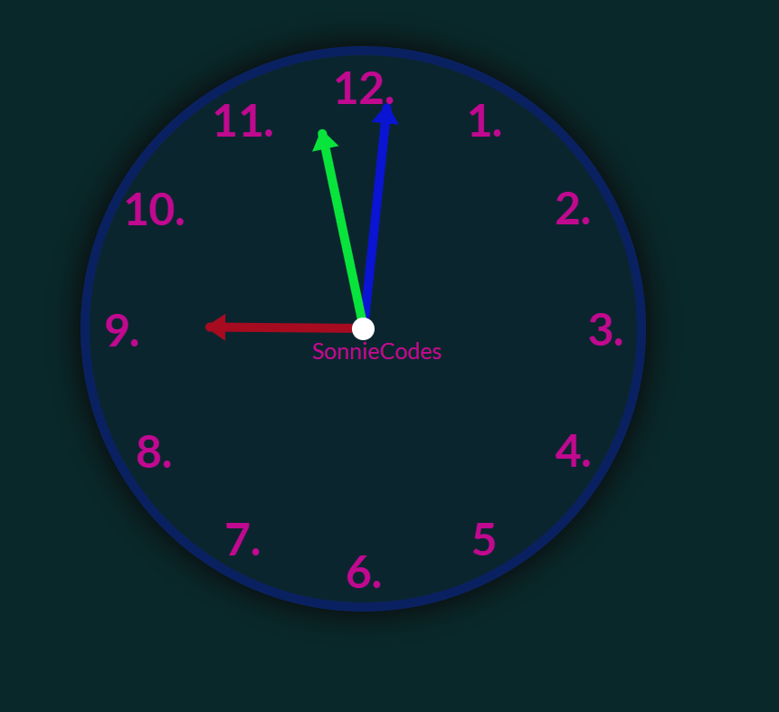

# Time Flies Analog Clock

Tick-tock, tick-tock! Welcome to Time Flies Analog Clock, where time is not just a number, but a rhythmic dance of hands around a timeless dial.

## About

Time Flies Analog Clock is a whimsical project that brings the charm of traditional timekeeping into the digital world. Built using HTML, CSS, and JavaScript, this clock is not just a functional timepiece but a delightful experience that reminds us to cherish each passing moment.

### Features
* Classic Design: Enjoy the timeless elegance of an analog clock face with gracefully moving hour, minute, and second hands.

* Interactive Experience: Hover over the clock to reveal additional information such as the current time in digital format.

* Customizable Styles: Tailor the appearance of the clock to suit your taste with customizable CSS styles.

* Responsive Layout: Experience the beauty of Time Flies Analog Clock across various devices and screen sizes.

